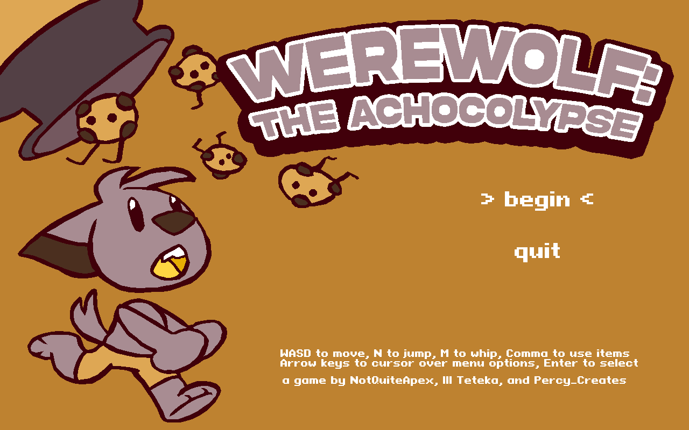
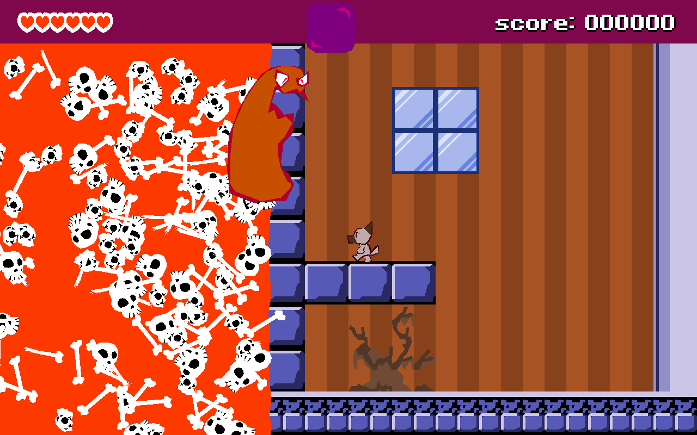
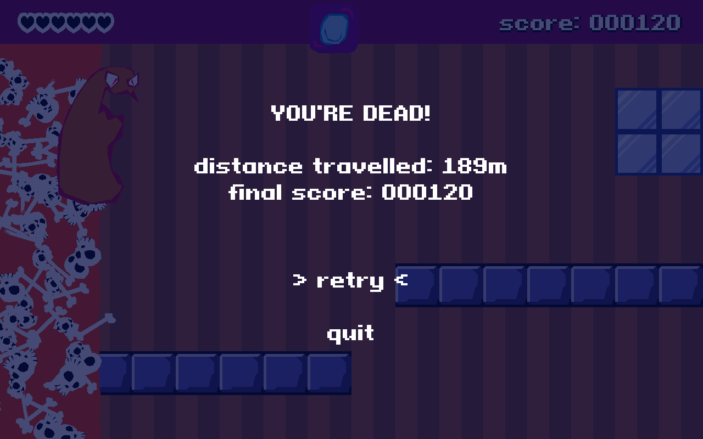
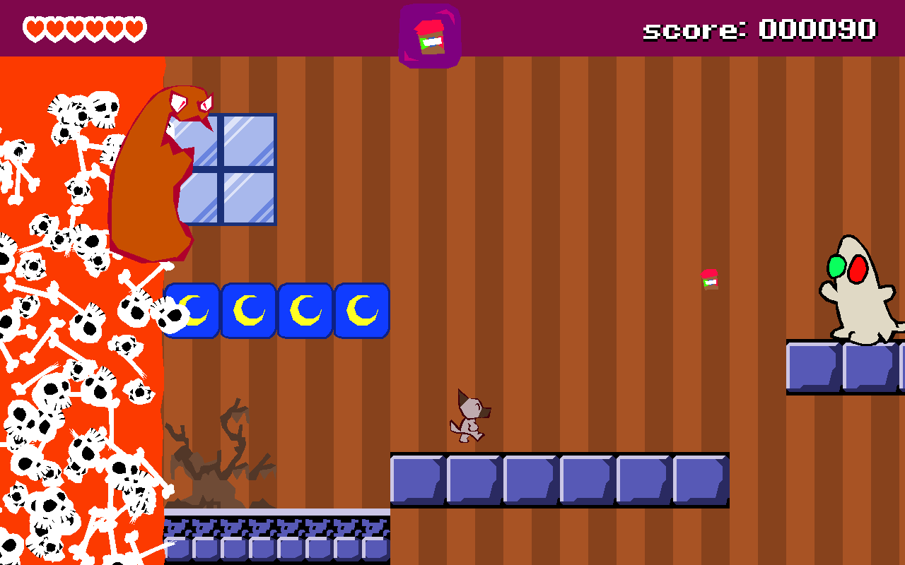

# Werewolf: the Achocolypse
The great Journel of the local chocolate factory has taken the last of the dog treats from the local grocery. You go to confront him and are suddenly chased by him and his wall of deadly (to you) chocolate and his goons patrolling the area! RUN!

Window can be resized to any resolution, all graphics are 2D vector imagery!

## Controls
Menu: Arrow keys to move cursor, Enter to select, Escape to exit at any time. Game: WASD to move, N to jump, M to whip, Comma to use subweapon.

# Credits
* Ill Teteka - Code, Art, Music, Design
* NotQuiteApex - Code, Art, Design
* Percy_Creates - Art, Design

# Libraries
* Sodalite Engine - Ill Teteka
* lume.lua - rxi
* bump.lua - kikito
* class.lua - Bartbes (2009, source unknown)
